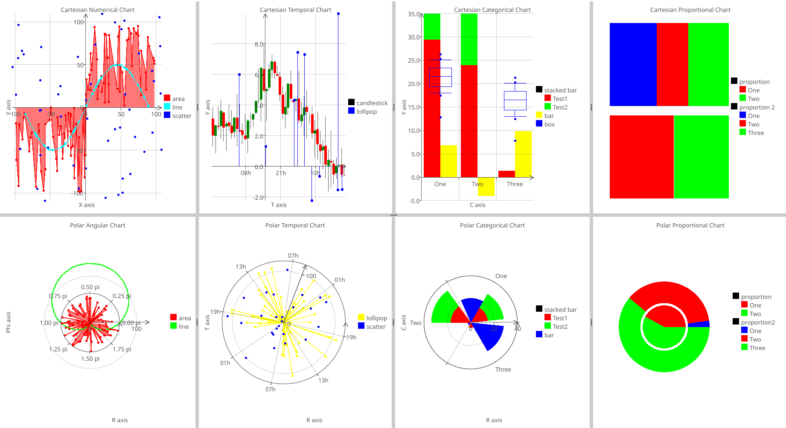

[](https://pkg.go.dev/github.com/s-daehling/fyne-charts)
[](https://goreportcard.com/report/github.com/s-daehling/fyne-charts)
[](https://opensource.org/licenses/BSD-3-Clause)

# fyne-charts

fyne-charts provides widgets for data visualization for the [Fyne UI toolkit](https://fyne.io/).
It does not rely on other chart libraries.
Instead widgets are composed of native Fyne-CanvasObjects like canvas.Line, canvas.Circle or canvas.Rectangle.
They adapt to the available size, can be updated dynamically and provide some user interaction.

Currently supported are widgets to visualize data in a 2D coordinate systems (cartesian or polar).
More widgets are planned.

**Note: fyne-charts is in an early development stage. The API might still change in the future.**

## Prerequesites and Getting Started

fyne-charts is an extension of Fyne.
Before starting with fyne-charts, make sure Fyne is correctly installed.
You can find more information on how to get started with Fyne on their [website](https://docs.fyne.io/started/).

After setting up Fyne, inlcude fyne-charts in your project:

```sh
go get github.com/s-daehling/fyne-charts
```

Now you can create a simple chart with the following code example:

```go
package main

import (
    "image/color"
    "math"
    "math/rand/v2"

    "github.com/s-daehling/fyne-charts/pkg/coord"
    "github.com/s-daehling/fyne-charts/pkg/data"

    "fyne.io/fyne/v2"
    "fyne.io/fyne/v2/app"
)

func main() {
    myApp := app.New()
    myWindow := myApp.NewWindow("fyne-charts")

    nc := coord.NewCartesianNumericalChart()
    _, err := nc.AddLineSeries("line", randomSine(50, 100, 40), true, color.RGBA{R: 0x00, G: 0xff, B: 0x00, A: 0xff})
    if err != nil {
        panic(err)
    }
    _, err = nc.AddScatterSeries("scatter", randomSine(50, 60, 60), color.RGBA{R: 0x00, G: 0x00, B: 0xff, A: 0xff})
    if err != nil {
        panic(err)
    }
    nc.SetTitle("fyne-charts example")

    myWindow.SetContent(nc)
    myWindow.Resize(fyne.NewSize(200, 200))
    myWindow.ShowAndRun()
}

func randomSine(n int, l float64, amp float64) (ndp []data.NumericalDataPoint) {
    for range n {
        var p data.NumericalDataPoint
        p.N = (-l / 2) + (rand.Float64() * l)
        p.Val = amp * math.Sin((p.N/(l))*2*math.Pi)
        ndp = append(ndp, p)
    }
    return
}
```

A demo of fyne-charts can be found in ``cmd/main.go``

## Widgets

### Two-Dimensional Coordinate System Charts

fyne-charts provides six widgets for visualization of two-dimensional data in a coordinate system.
They differ in the coordinate system that is used and in the kind of data that is mapped.

fyne-charts provides two possible coordinate systems:

* Cartesian (mapping from a x-axis to an orthogonal y-axis)
* Polar (mapping from a phi-axis to a radial r-axis)

In both coordinate systems different data types can be used for the "from-axis" (x or phi):

* Numerical: data that is represented by a number (implemented as float64),
* Temporal: data that is represented by a timestamp (implemented as time.Time) and
* Categorical: data that is represented by a name (implemented as string).

The "to-axis" (y or r) is always a numerical axis (float64).

The data ranges of the resulting six widgets are summerized in the table below.

||Numerical|Temporal|Categorical|
|-|-|-|-|
|Cartesian x-axis|any valid float64|any valid time.Time|any valid string|
|Cartesian y-axis|any valid float64|any valid float64|any valid float64|
|Polar phi-axis|0 <= phi <= 2pi|any valid time.Time|any valid string|
|Polar r-axis|r >= 0|r >= 0|r >= 0|

Every chart can hold multiple sets of data.
Each data set is called a series.
Different types of series exist.
The following table gives an overview of all series types and their availability in the different chart types.

|(Cartesian / Polar)|Numerical|Temporal|Categorical|
|-|-|-|-|
|Line|y / y|y / y|n / n|
|Area|y / y|y / y|n / n|
|Scatter|y / y|y / y|y / y|
|Lollipop|y / y|y / y|y / y|
|Box|y / n|y / n|y / n|
|Candlestick|y / n|y / n|n / n|
|Bar|y / y|y / y|y / y|
|Stacked Bar|n / n|n / n|y / y|

Below you can find a screenshot with all six widgets and different series.



In order to visualize one or multiple data series, first you must create an empty chart widget.
Package `github.com/s-daehling/fyne-charts/pkg/coord` provides the six chart widget discussed above:

* `CartesianNumericalChart`
* `CartesianTemporalChart`
* `CartesianCategoricalChart`
* `PolarNumericalChart`
* `PolarTemporalChart`
* `PolarCategoricalChart`

For example, creating a chart with a cartesian coordinate system and numerical x-axis looks like this:

```go
numChart := coord.NewCartesianNumericalChart()
```

The data types for data to be visualized in the chart are defined in `github.com/s-daehling/fyne-charts/pkg/data`.
The simplest data type is `data.NumericalDataPoint` mapping one numerical value to another.

Each chart provides a set of methods to create the data series.
These methods have the form `numChart.New[...]Series` with `[...]` being the series type.
Each series has a user-given name which must me unique throughout the chart.
Creating a scatter series on the previously created chart is done by

```go
numData := []data.NumericalDataPoint{
    {N: 10, Val: 20},
    // ... more data points
}
ser, err := numChart.AddScatterSeries("line", numData, color.RGBA{R: 0x00, G: 0xff, B: 0x00, A: 0xff})
```

The method `AddScatterSeries` takes the name of the series, the data to be visualized and the color to be used.
It returns a `coord.NumericalScatterSeries` object, that can be used to manipulate the series, and an error (e.g. when a series with the same name already exists).

The series object provides methods to add/delete data or to change the appearance of the series. The following example deletes all data points within the range of 10 < N < 15.

```go
_, err = ser.DeleteDataInRange(10, 15)
```

By default the chart automatically calculates the range of the axes such that all data points are visible.
You can also specify a fixed range for each axis.
Here is an example how to show the range between 10 and 20 on the x-axis:

```go
err = numChart.SetXRange(10, 20)
```

If you want to enable automatic range calculation again, you can do so by calling

```go
numChart.SetAutoXRange()
```

Besides adding series and setting axis ranges you can set the chart title and axis labels:

```go
numChart.SetTitle("My first Chart")
numCHart.SetXAxisLabel("x-axis")
```

A legend listing all series is created on the right side of the widget.
Each entry has a rectangle filled with the corresponding color of the series.
Tapping the rectange toggles the visibility of the series in the chart.

### Proportional Data Charts

Analogous to the coordinate system charts, also proportional data charts can be drawn in two ways importing package `github.com/s-daehling/fyne-charts/pkg/prop`:

* Horizontal Bars using `BarChart`
* Pie/Doughnut using `PieChart`

Creating a Pie/Doughnut chart is created like this:

```go
propChart := prop.NewPieChart()
```

Adding a new series is done by:

```go
propData := []data.ProportionalDataPoint{
    {
        C:   "One",
        Val: rand.Float64() * 222,
        Col: color.RGBA{R: 0xff, G: 0x00, B: 0x00, A: 0xff},
    },
    {
        C:   "Two",
        Val: rand.Float64() * 222,
        Col: color.RGBA{R: 0x00, G: 0xff, B: 0x00, A: 0xff},
    },
}
_, err := propChart.AddSeries("pie", propData)
```

The first data series is drawn as pie (full circle).
When more series are added they are drawn as doughnut.

When stacked bars are used, the different series are added on top of each other.

Similar methods as for the coordinate system charts are provided for series and chart manipulation.

## Documentation

Documentation is available on [pkg.go.dev](https://pkg.go.dev/github.com/s-daehling/fyne-charts)

## License

The project is licensed under BSD 3-Clause License.
