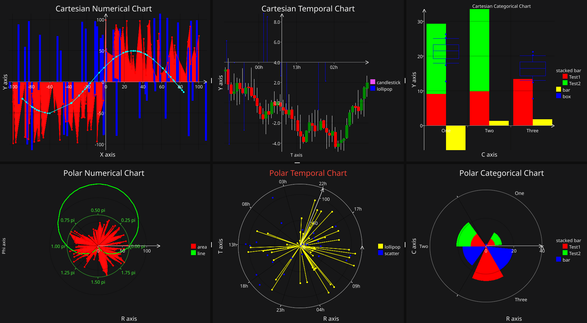
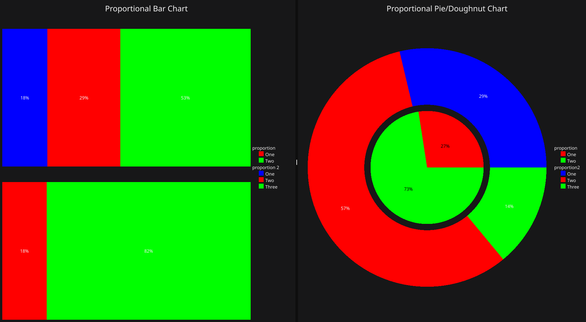

[](https://pkg.go.dev/github.com/s-daehling/fyne-charts)
[](https://goreportcard.com/report/github.com/s-daehling/fyne-charts)
[](https://opensource.org/licenses/BSD-3-Clause)

# fyne-charts

fyne-charts provides widgets for data visualization for the [Fyne UI toolkit](https://fyne.io/).
It does not rely on other chart libraries.
Instead widgets are composed of native Fyne-CanvasObjects like canvas.Line, canvas.Circle or canvas.Rectangle.
They adapt to the available size, can be updated dynamically and provide some user interaction.

Currently supported are widgets to visualize data in a 2D coordinate systems (cartesian or polar) and proportional data.
More widgets are planned.

**Note: fyne-charts is in an early development stage. The API might still change in the future.**

## Prerequesites and Getting Started

fyne-charts is an extension of Fyne.
Before starting with fyne-charts, make sure Fyne is correctly installed.
You can find more information on how to get started with Fyne on their [website](https://docs.fyne.io/started/).

After setting up Fyne, inlcude fyne-charts in your project:

```sh
go get github.com/s-daehling/fyne-charts
```

Now you can create a simple chart with the following code example:

```go
package main

import (
    "fyne.io/fyne/v2"
    "fyne.io/fyne/v2/app"
    "fyne.io/fyne/v2/theme"

    "github.com/s-daehling/fyne-charts/pkg/coord"
    "github.com/s-daehling/fyne-charts/pkg/data"
)

func main() {
    a := app.New()
    w := a.NewWindow("fyne-charts demo")

    chart := coord.NewCartesianCategoricalChart("Example Chart")
    chart.SetCAxisLabel("Categories")
    chart.SetYAxisLabel("Value")

    cps, err := coord.NewCategoricalPointSeries("Bar Series", theme.ColorNamePrimary, []data.CategoricalPoint{{
        C:   "One",
        Val: 15,
    }, {
        C:   "Two",
        Val: 30,
    }, {
        C:   "Three",
        Val: 45,
    }})
    if err != nil {
        panic(err)
    }
    err = chart.AddBarSeries(cps)
    if err != nil {
        panic(err)
    }

    w.SetContent(chart)
    w.Resize(fyne.NewSize(500, 300))
    w.ShowAndRun()
}
```

Demos of fyne-charts can be found in ``cmd/``

## Widgets

### Two-Dimensional Coordinate System Charts



fyne-charts provides six widgets for visualization of two-dimensional data in a coordinate system.
They differ in the coordinate system that is used and in the kind of data that is mapped.

fyne-charts provides two possible coordinate systems:

* Cartesian (mapping from a x-axis to an orthogonal y-axis)
* Polar (mapping from a phi-axis to a radial r-axis)

In both coordinate systems different data types can be used for the "from-axis" (x or phi):

* Numerical: data that is represented by a number (implemented as float64),
* Temporal: data that is represented by a timestamp (implemented as time.Time) and
* Categorical: data that is represented by a name (implemented as string).

The "to-axis" (y or r) is always a numerical axis (float64).

The data ranges of the resulting six widgets are summerized in the table below.

||Numerical|Temporal|Categorical|
|-|-|-|-|
|Cartesian x-axis|any valid float64|any valid time.Time|any valid string|
|Cartesian y-axis|any valid float64|any valid float64|any valid float64|
|Polar phi-axis|0 <= phi <= 2pi|any valid time.Time|any valid string|
|Polar r-axis|r >= 0|r >= 0|r >= 0|

Every chart can hold multiple sets of data.
Each data set is called a series.
Different types of series exist.
The following table gives an overview of all series types and their availability in the different chart types.

|(Cartesian / Polar)|Numerical|Temporal|Categorical|
|-|-|-|-|
|Line|y / y|y / y|n / n|
|Area|y / y|y / y|n / n|
|Scatter|y / y|y / y|y / y|
|Lollipop|y / y|y / y|y / y|
|Box|y / n|y / n|y / n|
|Candlestick|y / n|y / n|n / n|
|Bar|y / y|y / y|y / y|
|Stacked Bar|n / n|n / n|y / y|

Package `github.com/s-daehling/fyne-charts/pkg/coord` provides the six chart widget discussed above:

* `CartesianNumericalChart`
* `CartesianTemporalChart`
* `CartesianCategoricalChart`
* `PolarNumericalChart`
* `PolarTemporalChart`
* `PolarCategoricalChart`

### Proportional Data Charts



Analogous to the coordinate system charts, also proportional data charts can be drawn in two ways.
The two corresponding chart widgets are provided by the package `github.com/s-daehling/fyne-charts/pkg/prop`:

* `BarChart`: Horizontal Bars
* `PieChart` Pie/Doughnut

## Documentation

Documentation is available on [pkg.go.dev](https://pkg.go.dev/github.com/s-daehling/fyne-charts)

## License

The project is licensed under BSD 3-Clause License.
